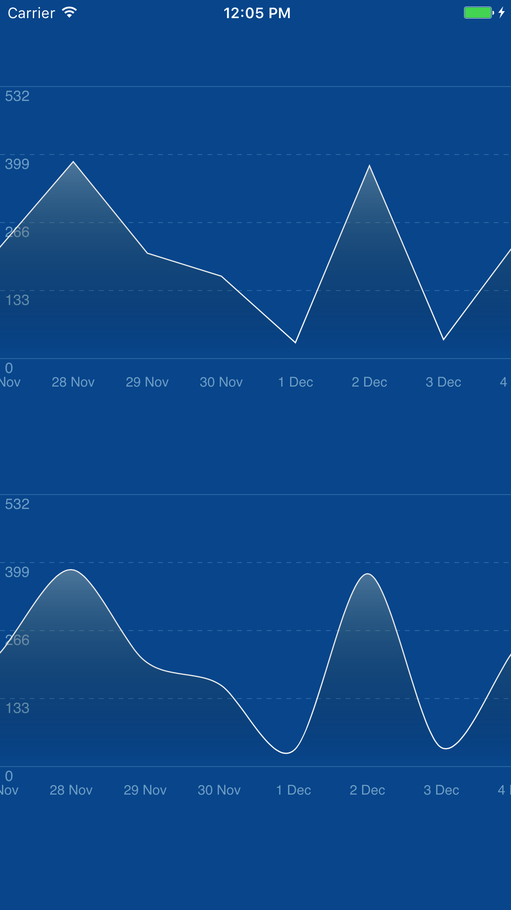

# LineChart
This code demonstrate a way to build your own line chart without using any third-party library. It contains a simple yet effective algorithm to build a curved line through a set of points. I don't recommend you to import LineChart.swift directly into your project because it is build for demonstration purpose only. However, you should modify it according to your needs.

# Demo

# Tutorial
[Tutorial on Medium](https://medium.com/@leonardnguyen/building-your-own-chart-in-ios-part-2-line-chart-7b5cfc7c866)

# Authors

Minh Nguyen, nvnminh0@gmail.com

# License

LineChart is available under the MIT license. See the LICENSE file for more info.
